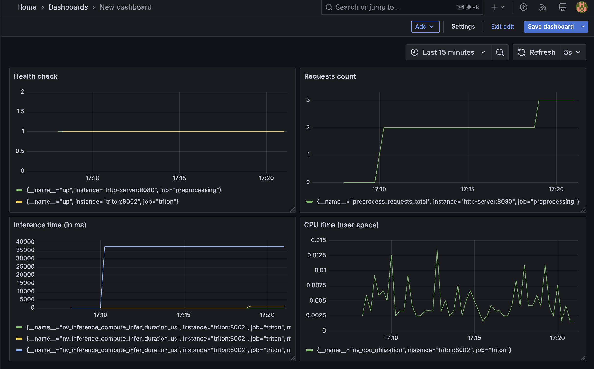

# Отчет

В рамках этого проекта предпологалось изучение пайплайнов по подготовке и конвертации готовых моделей в разных форматах для инференса, а также управление сборкой и оркестрацией на локальной машине пользователя Docker-контейнеров, что содержат микросервисы для разных доменных задач.

# Что было сделано?

- Прописаны этапы обучения и конвертаций моделей для инференса
- Описан манифест для поднятия и отслеживания микросервисов
- Интегрированы между собой этапы сбора информации через PULL подход при помощи Prometheus и отображения этой информации внутри Grafana

# Пример графиков

Источником данных является локальный клиент Prometheus, что обходит домены из конфига и забирает из них состояние сервисов. К этому клиенту Prometheus подключается база Grafana, которая считывает данные и предоставляет их для отрисовки.



# Логи

Логи можно собрать посмотрев в вывод команды `docker logs <container-name-or-hash>`. Например, вывод логов для HTTP-сервиса с предобработкой изображения.

```bash
(.venv) dmitrii.kolpakov@dmitrii-kolpakov mlops-project % docker logs http-server
INFO:     Started server process [1]
INFO:     Waiting for application startup.
INFO:     Application startup complete.
INFO:     Uvicorn running on http://0.0.0.0:8080 (Press CTRL+C to quit)
INFO:     172.19.0.3:40946 - "GET /inf/metrics HTTP/1.1" 200 OK
INFO:     172.19.0.3:40946 - "GET /inf/metrics HTTP/1.1" 200 OK
INFO:     172.19.0.3:40946 - "GET /inf/metrics HTTP/1.1" 200 OK
INFO:     172.19.0.3:40946 - "GET /inf/metrics HTTP/1.1" 200 OK
INFO:     172.19.0.3:40946 - "GET /inf/metrics HTTP/1.1" 200 OK
```

# Пример тестирования

Пример интеграционного тестирования:

```bash
(.venv) dmitrii.kolpakov@dmitrii-kolpakov mlops-project % python3 test.py test/test_image_1.png pytorch_model
{"status": "success", "data": {"model_name": "pytorch_model", "model_version": "1", "outputs": [{"name": "output", "datatype": "FP32", "shape": [1, 10], "data": [-3.9946651458740234, -6.559492588043213, -2.599630832672119, -1.6544920206069946, -7.911178112030029, -3.348123550415039, -3.372025489807129, -5.604841232299805, -3.9674928188323975, -3.0228657722473145]}]}}

(.venv) dmitrii.kolpakov@dmitrii-kolpakov mlops-project % python3 test.py test/test_image_1.png onnx_model   
{"status": "success", "data": {"model_name": "onnx_model", "model_version": "1", "outputs": [{"name": "output", "datatype": "FP32", "shape": [1, 10], "data": [-3.994664430618286, -6.559492111206055, -2.5996310710906982, -1.6544917821884155, -7.9111785888671875, -3.3481249809265137, -3.3720273971557617, -5.604840278625488, -3.9674923419952393, -3.0228655338287354]}]}}

{"status": "success", "data": {"model_name": "onnx_optimized", "model_version": "1", "outputs": [{"name": "output", "datatype": "FP32", "shape": [1, 10], "data": [-3.994664430618286, -6.559492111206055, -2.5996310710906982, -1.6544917821884155, -7.9111785888671875, -3.3481249809265137, -3.3720273971557617, -5.604840278625488, -3.9674923419952393, -3.0228655338287354]}]}}
```